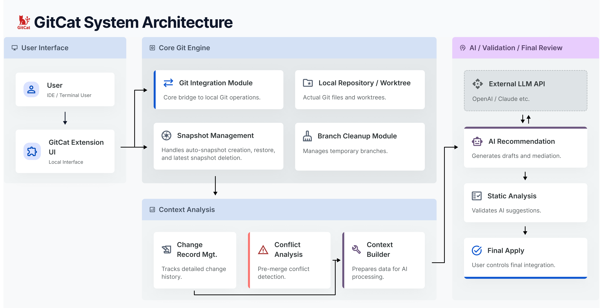

# 03. 시스템 아키텍처 / 모듈 명세서

### 핵심 요약

- GitCat은 VS Code Extension 기반의 로컬 실행형 Git 보조 도구이다.
- AI 작업 전 자동 스냅샷 생성과 작업 단위 원복을 통해 로컬 작업 안전성을 높이며, 가장 최근 자동 스냅샷 1건에 한해 사용자 삭제를 지원한다.
- 병합 전 충돌 후보를 탐지하고, AI 기반 병합 초안 및 중재안을 제공한다.
- 사용자는 AI 제안과 정적 분석 결과를 검토한 뒤 최종 반영 여부를 직접 결정한다.
- 서버 연동 및 팀 단위 동기화는 MVP 범위에서 제외한다.

---

[GitCat 모듈 정의](GitCat_module.csv)

[기술 스택](GitCat_tech_stack.csv)

---

## 1. 문서 목적

본 문서는 GitCat의 로컬 실행 기반 MVP를 구현하기 위한 전체 구조와 주요 모듈 구성을 정의한다.

특히 자동 스냅샷, 작업 단위 원복, 병합 전 충돌 후보 탐지, AI 기반 병합 초안 및 중재안 생성, 변경 기록 저장 및 활용 기능이 어떤 구조로 동작하는지 정리하는 것을 목표로 한다.

---

## 2. 적용 범위

이번 문서는 서버 없는 로컬 MVP를 기준으로 작성한다.

VS Code Extension 내부에서 Git 상태를 수집하고, AI 작업 전 자동 스냅샷을 생성하며, 병합 전 충돌 후보를 탐지하고, AI 기반 병합 초안 및 중재안을 생성한 뒤, 사용자가 검토 후 반영하는 흐름을 다룬다.

서버 연동, 사용자 계정, 팀 단위 동기화, 원격 저장소 기반 분석은 고도화 범위로 제외한다.

---

## 3. 전체 구조

GitCat은 VS Code Extension 형태로 동작한다.

사용자 액션은 UI 모듈에서 시작되며, 내부적으로 Git 상태 수집 모듈, Snapshot 관리 모듈, 변경 기록 관리 모듈, 충돌 분석 모듈, AI 호출 모듈, 정적 분석 모듈이 연결된다.
이 중 Snapshot 관리 모듈은 AI 작업 직전 자동 스냅샷 생성과 작업 단위 원복뿐 아니라, 가장 최근에 생성된 자동 스냅샷 1건에 대한 삭제 요청 처리와 상태 갱신도 담당한다.

최종 결과는 다시 UI에 표시되고, 사용자가 반영 여부를 결정한다. 

---

## 4. 기술 스택 선정

GitCat은 로컬 실행 기반 MVP를 목표로 하므로, VS Code 내부에서 빠르게 구현 가능하고 디버깅이 용이한 기술을 우선 적용한다.

핵심 구현 언어는 TypeScript이며, 확장 프로그램 구조는 VS Code Extension API를 기준으로 설계한다. UI는 Tree View와 Webview를 조합하여 구성하고, Git 상태 수집은 로컬 git CLI 호출 방식으로 처리한다.

또한 자동 스냅샷과 변경 기록은 JSON + patch/diff 기반의 로컬 저장 구조로 관리하며, AI가 생성한 결과의 최소 구조적 안정성 점검을 위해 TypeScript Compiler API와 ESLint를 활용한다.

세부 기술 항목과 적용 범위는 상단 기술 스택 DB를 기준으로 관리한다.

---

## 5. 주요 동작 흐름

GitCat의 기본 동작은 AI 작업 또는 병합 분석 요청을 시작점으로 한다. 사용자가 기능을 실행하면 GitCat은 먼저 현재 Git 상태를 수집한다.

AI 작업의 경우, GitCat은 작업 직전 상태를 자동 스냅샷으로 저장한 뒤 AI 작업을 수행한다. 이후 결과를 사용자에게 보여주고, 필요 시 원복할 수 있도록 한다.

또한 사용자는 스냅샷 이력 화면에서 가장 최근에 생성된 자동 스냅샷 1건에 한해 삭제를 요청할 수 있다.
GitCat은 삭제 요청 시 해당 스냅샷이 현재 삭제 가능한 최신 대상인지 검증한 뒤 삭제를 수행하며, 삭제된 스냅샷은 이후 원복 대상에서 제외된다.

병합 분석의 경우, GitCat은 현재 브랜치와 비교 대상 브랜치의 변경 내용을 비교하여 충돌 후보를 탐지한다. 이후 관련 변경 기록을 함께 조회해 AI 입력 컨텍스트를 구성하고, 이를 바탕으로 병합 초안과 중재안을 생성한다.

생성된 결과는 정적 분석을 거친 뒤 UI에 표시되며, 사용자는 이를 검토한 후 최종 반영 여부를 결정한다.

### 부가 기능 동작 흐름

- **AI 추천 기능**: 변경 파일, diff, 현재 브랜치명, 작업 설명 등을 수집한 뒤 AI를 통해 커밋 메시지, 브랜치명, PR 설명을 추천한다. 사용자는 추천 결과를 그대로 사용하거나 수정 후 적용할 수 있다.
- **브랜치 정리 기능**: 로컬 브랜치 목록을 조회한 뒤 정리 후보를 사용자에게 표시하고, 사용자가 선택한 브랜치에 대해 정리 작업을 수행한다. 정리 결과는 UI에 표시된다.

---

## 6. 주요 모듈 구성

- **VS Code Extension UI 모듈** : 사용자 액션 입력과 결과 표시를 담당한다.
- **Git 상태 수집 모듈** : 현재 브랜치와 변경 상태를 조회한다.
- **Snapshot 관리 모듈** : AI 작업 전 스냅샷 생성, 작업 단위 원복, 최근 자동 스냅샷 1건 삭제와 스냅샷 상태 관리를 담당한다.
- **변경 기록 관리 모듈** : AI 작업별 변경 기록을 관리한다.
- **충돌 분석 모듈** : 병합 전 충돌 후보를 식별한다.
- **AI 호출 모듈** : 병합 초안과 추천 결과 생성을 담당한다.
- **정적 분석 모듈** : AI 결과의 최소 구조적 안정성을 점검한다.
- **협업 텍스트 추천 기능** : 커밋 메시지, 브랜치명, PR 설명 추천을 담당한다.
- **브랜치 정리 모듈** : 로컬 브랜치 조회와 정리 기능을 담당한다.

---

## 7. 데이터 흐름

GitCat의 데이터 흐름은 사용자 요청을 시작점으로 한다. 사용자가 기능을 실행하면 UI 모듈이 내부 처리 흐름을 시작하고, Git 상태 수집 모듈이 현재 브랜치와 변경 상태를 조회한다.

AI 작업이 포함된 경우에는 Snapshot 관리 모듈이 작업 직전 상태를 자동 스냅샷으로 저장한다. 작업 완료 이후에는 변경 기록 관리 모듈이 변경 결과를 기록으로 저장한다.

병합 분석 요청이 들어오면 충돌 분석 모듈이 위험 구간을 식별하고, 변경 기록 관리 모듈이 관련 기록을 조회하여 AI 호출 모듈에 전달한다. AI 호출 모듈은 이를 바탕으로 병합 초안과 중재안을 생성한다.

생성된 결과는 정적 분석 모듈을 거쳐 최소 구조적 안정성을 점검한 뒤 UI에 표시된다. 이후 사용자는 결과를 검토하고 최종 반영 여부를 결정하며, 해당 결과는 다시 기록으로 남는다.

사용자가 스냅샷 삭제를 요청하는 경우에는 UI 모듈이 Snapshot 관리 모듈에 삭제 요청을 전달한다.
Snapshot 관리 모듈은 해당 대상이 가장 최근에 생성된 자동 스냅샷인지 검증한 뒤 삭제를 수행하고, 갱신된 스냅샷 목록과 원복 가능 상태를 다시 UI에 반영한다.

---

## 8. 저장 구조

GitCat은 Git 공식 커밋 이력과 별도로 로컬 저장 구조(SQLite 메타데이터 및 로컬 파일 시스템)를 사용한다. 저장 대상은 크게 스냅샷 정보, 변경 기록, 병합 분석 결과 및 AI 데이터로 나뉜다.

- 스냅샷 정보: 스냅샷 ID, 생성 시각, 브랜치명, 변경 파일 목록, patch 또는 diff, 원복 가능 여부, 최신 삭제 가능 여부
- 변경 기록: 변경 기록 ID, 작업 ID, 관련 스냅샷 ID, 수정 파일, 수정 위치, 작업 설명
- 병합 분석 결과: 충돌 후보 구간, 관련 변경 기록, 병합 초안, 중재안, 정적 분석 결과, 사용자 반영 여부
- AI 및 추천 결과: AI 모델 요청 이력, 원문 응답(`/ai/responses/`), 병합 패치 초안(`/ai/patches/`), 사용자 피드백(수락/수정/거절) 및 최종 결과
- 브랜치 정리 결과: 정리 대상 브랜치 목록, 사용자 선택 결과, 정리 실행 결과

메타데이터는 SQLite에 저장하며, 대용량 원문 데이터(스냅샷 파일, diff/patch 원문, AI 응답 원문 등)는 로컬 워크스페이스 내 `.vscode/gitcat/` 디렉토리 하위에 보관한다. 추천 결과와 브랜치 정리 실행 결과는 필요 시 로컬 임시 상태 또는 로그 형태로 관리할 수 있다.

---

## 9. 핵심 기능별 처리 방식

- **AI 작업 전 자동 스냅샷 생성** : AI 작업 요청 시 현재 Git 상태를 수집하고 작업 직전 상태를 스냅샷으로 저장한다.
- **AI 작업 단위 원복** : 사용자가 선택한 스냅샷 시점으로 현재 작업 파일을 복원한다.
- **병합 전 충돌 후보 탐지** : 현재 브랜치와 비교 대상 브랜치의 변경 내용을 비교해 위험 구간을 사전에 식별한다.
- **AI 기반 병합 초안 및 중재안 생성** : 충돌 후보와 관련 변경 기록을 바탕으로 병합 초안과 중재안을 생성한다.
- **변경 기록 저장 및 활용** : AI 작업 종료 후 변경 기록을 저장하고, 이후 병합 분석 시 관련 기록을 선별해 활용한다.
- **사용자 검토 후 최종 반영** : AI 결과와 정적 분석 결과를 함께 보여주고, 사용자가 직접 반영 여부를 결정한다.
- **협업 텍스트 추천** : 변경 내용과 작업 정보를 바탕으로 커밋 메시지, 브랜치명, PR 설명을 추천한다.
- **로컬 브랜치 정리** : 로컬 브랜치 목록을 조회해 정리 후보를 표시하고, 사용자가 선택한 브랜치를 정리한다.
- **최근 자동 스냅샷 1건 삭제** : 사용자가 스냅샷 이력에서 가장 최근 자동 스냅샷 1건을 삭제 요청하면, 시스템이 삭제 가능 여부를 검증한 뒤 삭제를 수행하고 원복 대상 목록을 갱신한다.

---

## 10. UI 연계

UI는 크게 메인 작업 화면, 스냅샷 이력 확인 화면, 원복 확인 화면, 충돌 후보 분석 결과 화면, AI 병합 초안 검토 화면으로 구성한다.
메인 화면에서는 현재 브랜치, 변경 파일 수, 주요 액션을 표시하고, 상세 화면에서는 스냅샷 목록, 최근 자동 스냅샷 삭제 버튼, 충돌 후보 목록, AI 제안 결과, 반영 버튼 등을 제공한다.

---

## 11. 예외 처리 및 한계

- GitCat은 로컬 환경 기준으로 동작하므로 사용자 작업 상태에 따라 결과가 달라질 수 있다.
- 충돌 분석은 직접 충돌과 일부 간접 충돌 후보를 탐지하는 수준이며, 모든 간접 충돌을 완전히 식별하지는 못한다.
- AI 제안은 참고용이며 항상 정답을 보장하지 않으므로 사용자 검토가 필요하다.
- 정적 분석 통과 역시 실제 런타임 동작을 완전히 보장하지는 않는다.
- 스냅샷 삭제는 가장 최근 자동 스냅샷 1건에 한해 허용되며, 그 외 스냅샷은 삭제 대상이 아니다.
- 삭제된 스냅샷은 이후 원복 대상에서 제외된다.

---

## 12. MVP 범위 정리

이번 MVP 구현 범위는 자동 스냅샷 생성, 최근 자동 스냅샷 1건 삭제, 작업 단위 원복, 병합 전 충돌 후보 탐지, AI 기반 병합 초안 및 중재안 생성, 변경 기록 저장 및 활용, 정적 분석 기반 최소 검증, 사용자 검토 후 반영까지로 설정한다.

서버 연동과 협업 이력 공유 기능은 고도화 범위로 분리한다.

부가 기능으로는 커밋 메시지, 브랜치명, PR 설명 추천 기능과 로컬 브랜치 정리 기능을 포함한다.

다만 이 기능들은 자동 스냅샷, 작업 단위 원복, 병합 전 충돌 후보 탐지, AI 기반 병합 초안 및 중재안 생성보다 우선순위가 낮은 보조 기능으로 구분한다.